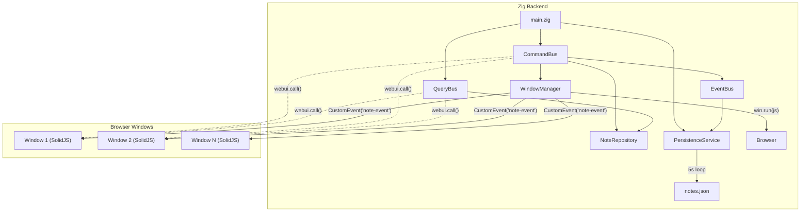
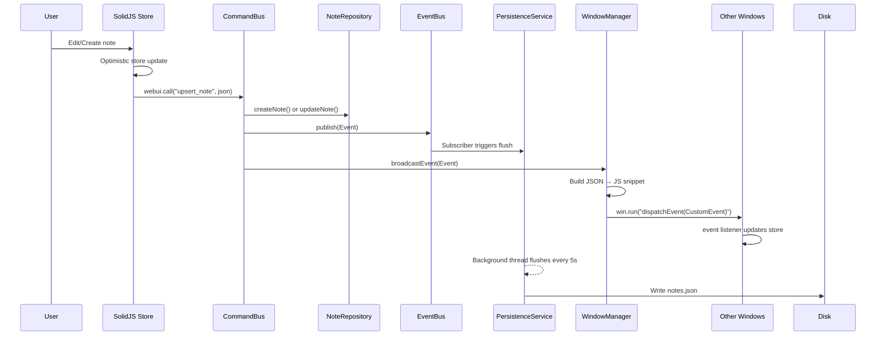
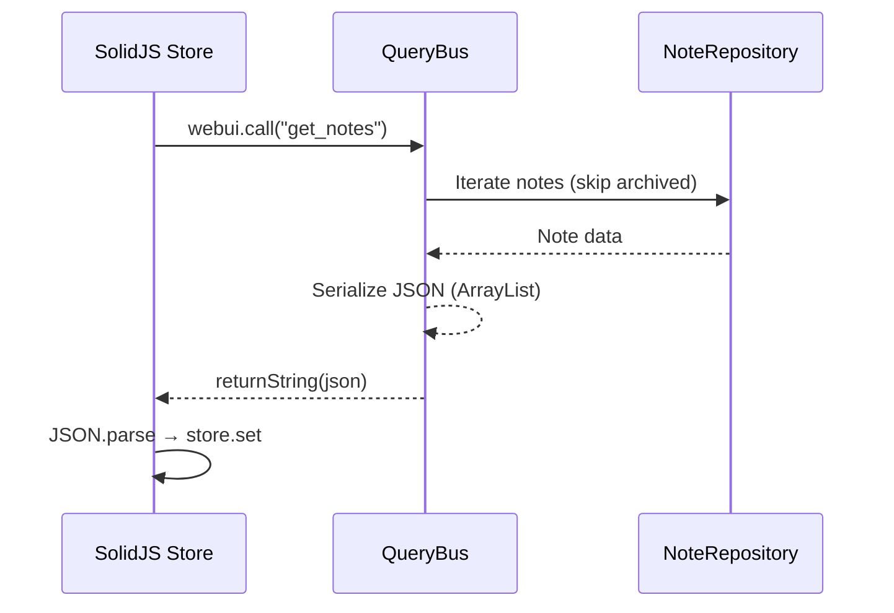
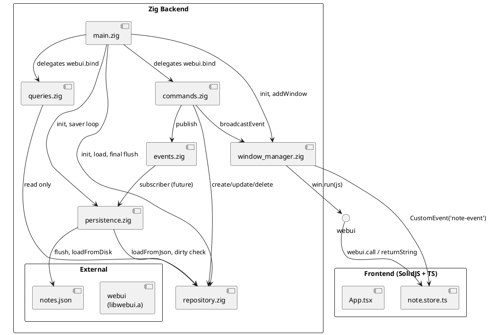
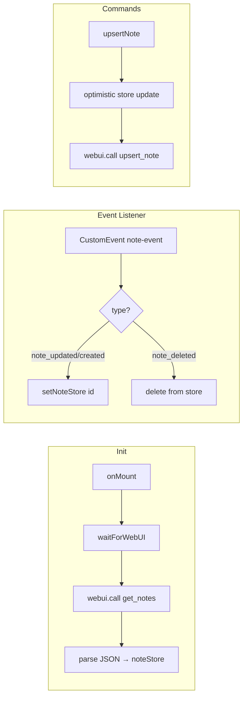

# Zig Disposable Notes

A **notes application** built with **Zig 0.16.0** (backend) and **SolidJS** (frontend), using a **CQRS + Event-Driven** architecture with **multi-window** support via [webui](https://webui.me).

---

## Architecture Overview

The app follows **CQRS** (Command Query Responsibility Segregation) with an **Event Bus** for internal notifications, a **Window Manager** for cross-window broadcast, and a **background persistence thread** that flushes changes every 5 seconds.



---

## Data Flow: Command

Optimistic UI update + fire-and-forget Zig command.



---

## Data Flow: Query

Direct synchronous reply to the requesting window.



---

## Module Map (Zig)

```
src/
├── root.zig            # Public re-exports
├── main.zig            # Wiring, init, saver thread
├── repository.zig      # Note & NoteRepository (in-memory HashMap)
├── events.zig          # Event, EventType, EventBus (pub/sub)
├── persistence.zig     # PersistenceService (JSON read/write)
├── commands.zig        # CommandBus (upsert, delete, archive)
├── queries.zig         # QueryBus (getNotes, getNote, search)
└── window_manager.zig  # WindowManager (broadcast via DOM events)
```

### PlantUML — Package & Component Diagram



---

## Component Responsibilities

### `repository.zig` — `Note` & `NoteRepository`
- In-memory storage using `std.StringHashMap(Note)`.
- All string allocations duplicated with the init-time arena allocator.
- `dirty: bool` flag tracks whether data has changed since last flush.
- `loadFromJson()` parses the `{"notes": {id: {...}}}` format with `std.json.parseFromSlice`.

### `events.zig` — `EventBus`
- Simple pub/sub with a flat list of listeners (`std.ArrayList(Listener)`).
- `Listener = *const fn (Event) void`.
- `Event` carries type, id, optional name/content, and archived flag.
- Currently subscribed by (future) persistence; always published by commands.

### `persistence.zig` — `PersistenceService`
- Serializes all notes to the `notes.json` file in the working directory.
- Uses the **Zig 0.16.0** `Io.Dir` / `Io` API (`createFile`, `openFile`, `readPositionalAll`, `writePositionalAll`).
- `loadFromDisk()` called once at startup.
- `flush()` is called from the background saver thread every 5 seconds (only if `dirty`).
- Final flush on shutdown.

### `window_manager.zig` — `WindowManager`
- Maintains a list of open `webui` windows.
- `broadcastEvent(Event)` builds a JSON blob, wraps it in a JS snippet that fires a `CustomEvent('note-event')`, then calls `win.run()` on every window.
- Stack-allocated buffers (4096 + 8192 bytes) — no heap allocation during broadcast.

### `commands.zig` — `CommandBus`
- **Upsert**: Parses JSON, checks if note exists → `updateNote()` or `createNote()`, publishes event, broadcasts.
- **Delete**: Parses JSON for id → `deleteNote()`, publishes, broadcasts.
- **Archive**: Parses JSON for id → sets `archived = true`, publishes, broadcasts.
- Returns `bool(true)` on success, `bool(false)` on failure.

### `queries.zig` — `QueryBus`
- **getNotes**: Serializes all non-archived notes as JSON, returns via `returnString`.
- **getNote**: Returns a single note or `"null"`.
- **searchNotes**: Case-insensitive substring search on name + content, excluding archived.
- Output built via `std.ArrayList(u8)`, converted to `[:0]const u8` via `toOwnedSliceSentinel`.

### `main.zig` — Wiring & Entrypoint
- Initializes all services from `std.process.Init` (arena allocator + Io).
- Loads data from disk.
- Spawns `saverLoop` thread (blocking `nanosleep`).
- Binds webui callback functions to window.
- Shows main window, waits, cleanly shuts down.

---

## Frontend (SolidJS)



---

## JSON Wire Format

### `notes.json` (disk)

```json
{
  "notes": {
    "abc123": {
      "id": "abc123",
      "name": "Shopping",
      "content": "Milk, eggs, bread",
      "createdAt": "2026-06-19T10:00:00Z",
      "archived": false
    }
  }
}
```

### Broadcast Event (CustomEvent detail)

```json
{
  "type": "note_updated",
  "id": "abc123",
  "name": "Shopping",
  "content": "Milk, eggs, bread, butter"
}
```

### Command Payload (webui.call → Zig)

```json
{"id": "abc123", "name": "Shopping", "content": "Milk"}
```

### Query Response (Zig → webui.call)

```json
{"notes": {"abc123": {"id": "abc123", "name": "Shopping", ...}}}
```

---

## Key Design Decisions

| Decision | Rationale |
|---|---|
| **CQRS** | Separate read/write paths → simpler reasoning, no accidental mutations in queries |
| **Optimistic UI** | User sees instant feedback; command is fire-and-forget |
| **Event Bus** | Decouples command execution from side effects (persistence, broadcast) |
| **Background saver** | Avoids blocking the WebUI thread on every keystroke; batches writes |
| **Arena allocator** | All strings live for the app lifetime; no per-note free tracking needed |
| **Stack buffers** | Broadcast JSON/JS built on stack (4K + 8K) — zero heap alloc in hot path |
| **webui.run()** | Fire-and-forget JS execution; no response needed for broadcast |
| **No closure capture** | WebUI callbacks are plain freestanding functions; state accessed via globals |

---

## Build & Run

```bash
# Backend
zig build run

# Frontend (after editing)
cd frontend && pnpm build
```

---

## Zig 0.16.0 API Notes

- `std.ArrayList(T) = array_list.Aligned(T, null)` — unmanaged; `.empty` init, `append(allocator, item)`, `deinit(allocator)`.
- `std.json.Scanner.init` removed → use `std.json.parseFromSlice(T, allocator, input, .{})`.
- `std.time.sleep` removed → use `std.os.linux.nanosleep` (Linux) or `Io.sleep` (async).
- `std.io.fixedBufferStream` removed → manual buffer writes with `@memcpy`.
- File I/O uses `Io.Dir.openFile(dir, io, path, opts)`, `Io.Dir.createFile(dir, io, path, flags)`.
